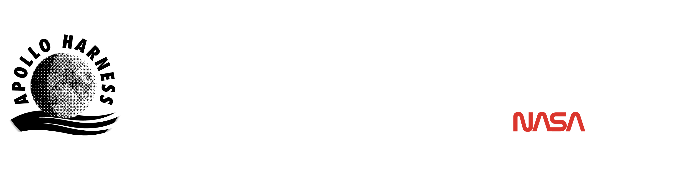

  

    

  
  
  
  
  
  

    

  

    <strong>Next-Generation Lunar Mission Intelligence & Environmental Analysis</strong> 
    <em>Engineered by <strong>Team Chhayanautical</strong> for NASA Space Apps Challenge 2026</em>
  

---

## 🌒 The Mission

**HarnessApollo** is an environmental intelligence initiative developed for the **NASA Space Apps Challenge 2026** (Challenge #4: *Commercial Lunar Payload Services (CLPS) Lunar Mission Browser*).

As commercial missions venture into uncharted lunar territories, navigating extreme polar environments demands transforming raw planetary science into intuitive, high-fidelity mission intelligence. 

HarnessApollo bridges planetary data archives with next-generation mission planning interfaces to evaluate lunar surface viability and environmental dynamics.

---

## 🔒 Status & Disclosure

> [!NOTE]  
> **Under Active Development — Competitive Embargo**  
> Detailed system schematics, telemetry calculation engines, and interactive application builds are withheld from public disclosure during development. Full interactive interfaces, telemetry adapters, and project documentation will be unveiled upon formal submission to the NASA Space Apps judging panel.

---

## 👥 Team & Contacts

**HarnessApollo** is engineered and maintained by **Team Chhayanautical**.

| Channel | Link / Address | Description |
|---|---|---|
| 🌐 **Official Website** | [chhayanautical.web.app](https://chhayanautical.web.app) | Mission portal & live web deployment |
| 🚀 **NASA Space Apps Team Finder** | [chhayanautical @ NSAC Finder](https://www.spaceappschallenge.org/2026/find-a-team/chhayanautical/) | Official team registration & participant roster |
| ✉️ **Direct Email** | [chhayanautical@gmail.com](mailto:chhayanautical@gmail.com) | Official team contact & inquiries |
| 🐙 **Project Repository** | [k-shopnil/apolloharness](https://github.com/k-shopnil/apolloharness) | Primary codebase & release tracking |

---

## 📄 License

This project is licensed under the [MIT License](LICENSE) © 2026 Team Chhayanautical.
