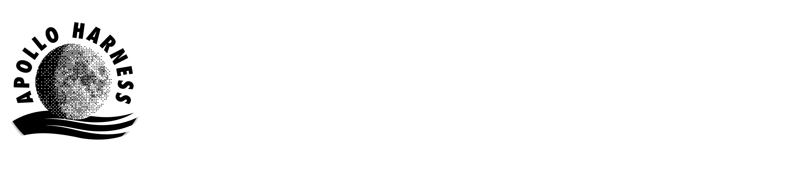

  

    

  
  
  
  
  

    

  

    <strong>CLPS Lunar Mission Browser & Environmental Analysis Platform</strong> 
    <em>Engineered by <strong>Team Chhayanautical</strong> for NASA Space Apps Challenge 2026</em>
  

---

## 🌒 Overview

**HarnessApollo** is an environmental intelligence and mission analysis platform designed for NASA's **Commercial Lunar Payload Services (CLPS)** initiative. 

As commercial landers and rovers venture into the challenging terrains of the lunar south pole—where temperatures drop to -240°C and transient shadows can critically impact surface survival—HarnessApollo provides operational visibility and comparative multi-mission telemetry.

### Core Capabilities

- **☀️ Solar Illumination & Shadow Dynamics:** High-resolution tracking of sunlit peaks and volatile cold traps across critical landing sites (Shackleton Ridge, Malapert A, Mons Mouton, Haworth Crater).
- **🧊 Volatile Ice Proximity:** Spatial proximity analysis to Permanently Shadowed Region (PSR) volatile and water-ice deposits.
- **📡 Direct-to-Earth (DTE) Comms:** Modeling line-of-sight availability windows for real-time mission telemetry and science downlink.
- **⛰️ Slope & Terrain Hazards:** Micro-slope topographic hazard evaluation for safe landing precision and rover traverse safety.
- **🛰️ Multi-Lander Fleet Comparison:** Side-by-side environmental benchmarking across CLPS providers (Intuitive Machines, Astrobotic, Firefly Aerospace, and more).

---

## 🛠️ Projected Architecture & Tech Stack

| Domain | Badges | Purpose |
|---|---|---|
| **Mission Telemetry & UI** |    | High-density aerospace dashboard & mission browser |
| **Styling & Design System** |   | Lunar Industrial Minimalist design system (*Swiss typographic grid*) |
| **Lunar Altimetry & Data** |    | High-resolution lunar south pole topographic & shadow maps |
| **Orbital Mechanics** |  | Real-time direct-to-Earth line-of-sight & solar ephemeris vectors |

---

## 👥 Team & Contacts

**HarnessApollo** is engineered and maintained by **Team Chhayanautical** participating in the **NASA Space Apps Challenge 2026** (Challenge #4: *CLPS Lunar Mission Browser*).

| Channel | Link / Address | Description |
|---|---|---|
| 🌐 **NASA Space Apps Team Finder** | [chhayanautical @ NSAC Finder](https://www.spaceappschallenge.org/2026/find-a-team/chhayanautical/) | Official team registration & participant roster |
| ✉️ **Direct Email** | [shopnilmax@gmail.com](mailto:shopnilmax@gmail.com) | Team Lead contact & general correspondence |
| 🚀 **Project Repository** | [k-shopnil/apolloharness](https://github.com/k-shopnil/apolloharness) | Primary open-source codebase & issue tracker |

---

## 🚀 Status

> [!NOTE]  
> This repository is currently under active development as part of the **NASA Space Apps Challenge 2026** submission. Full codebase, telemetry pipelines, and interactive interfaces will be pushed shortly.

---

## 📄 License

This project is licensed under the [MIT License](LICENSE) © 2026 Team Chhayanautical.
